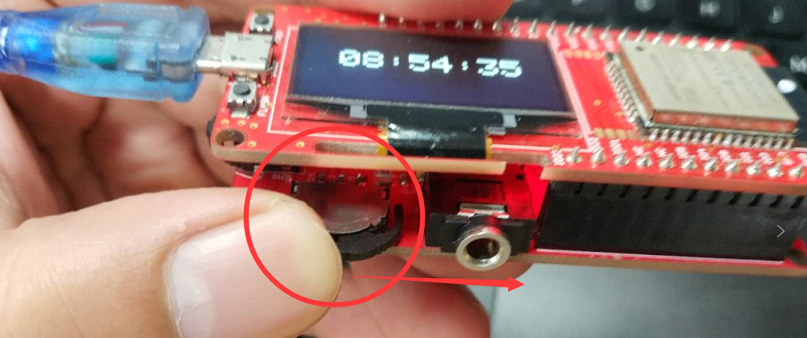

# ESP32 Web Radio

```c++
/*
Version:		V1.0
Author:			Vincent
Create Date:	2020/7/31
Note:
```


[toc]

# OVERVIEW

## Intruduce

[Makerfabs home page](https://www.makerfabs.com/)

[Makerfabs Wiki](https://makerfabs.com/wiki/index.php?title=Main_Page)

MakePython Audio inherited the DAC chip and SD card module.The I2S chip allows you to play songs stored on Internet .The SSD1306 screen displays basic information about the song, and the scroll wheel switch on Audio allows you to switch and pause the music.


## Equipment list

- [MakePython ESP32](https://www.makerfabs.com/wiki/index.php?title=MakePython_ESP32)
- [MakaPython Audio](https://www.makerfabs.com/wiki/index.php?title=MakaPython_Audio)
- Audio/headphones with 3.5mm audio connector
- WiFi

# STEPS

## Prepare And Burn

**If you have any questions，such as how to install the development board, how to download the code, how to install the library. Please refer to :[Makerfabs_FAQ](https://github.com/Makerfabs/Makerfabs_FAQ)**

- Install board : esp32 .
- Install library : Adafruit SSD1306 and dependent libraries.
- Install zip library : [ESP32-audioI2S](https://github.com/schreibfaul1/ESP32-audioI2S)("Audio.h")
- Open file "/Project_ESP32-Web-Radio/web_radio/web_radio.ino"

- Change the time WiFi ssid and password.

```c++
//WIFI
const char *ssid = "Makerfabs";
const char *password = "20160704";
```


- Upload to esp32.
- **~~ATTENTION !!! Plug ESP32 and Audio expansion boards together after burning. Be sure to plug them together after burning or the firmware will not burn.~~** 
- **MicroPython Audio can be downloaded without unplugging. When uploading the program, please rotate the switch next to the 3.5mm Audio interface to the Audio socket.**



## How to use Web Radio

- Power the ESP32 via Micro USB and the LCD screen displays the radio url.

- Lower side switch, left and right for next song, Previous.Press inward to pause.
- The switch on the left, volume up and down.Press in to mute.


## Add Your Radios

- You can add radios into stations[ ] .

```c++
String stations[] = {
    "0n-80s.radionetz.de:8000/0n-70s.mp3",
    "mediaserv30.live-streams.nl:8000/stream",
    "www.surfmusic.de/m3u/100-5-das-hitradio,4529.m3u",
    "stream.1a-webradio.de/deutsch/mp3-128/vtuner-1a",
    "mp3.ffh.de/radioffh/hqlivestream.aac", //  128k aac
    "www.antenne.de/webradio/antenne.m3u",
    "listen.rusongs.ru/ru-mp3-128",
    "edge.audio.3qsdn.com/senderkw-mp3",
    "macslons-irish-pub-radio.com/media.asx"};
```

- You can also directly transfer the URL to ESP32 via a serial port.


# 3D Printer Box

We designed a simple 3D-printed case. Don't need support.

[STL File](https://github.com/Makerfabs/Project_MakePython_Audio_Music/)


